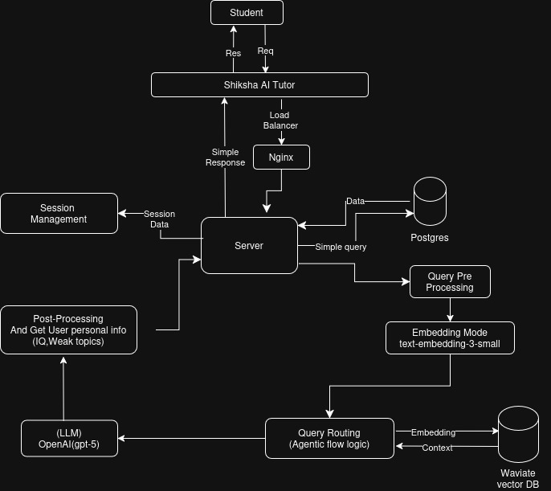

# Shiksha AI

An AI-powered educational platform designed for Indian students following CBSE curriculum. The platform provides personalized tutoring, adaptive quizzes, study planning, and progress tracking.

**Live Demo**: [shiksha-ai.vercel.app](https://shiksha-ai-beta.vercel.app)

## Architecture



## Features

### AI Tutor
- Conversational tutoring powered by GPT-5
- Context-aware responses using RAG (Retrieval Augmented Generation) with NCERT content
- Support for mathematical equations (LaTeX) and chemical formulas
- Session management with conversation history

### Quiz System
- AI-generated quizzes based on NCERT syllabus
- Adaptive difficulty levels (easy, medium, hard)
- Detailed explanations for each answer
- Performance tracking and weak topic identification

### Study Planner
- AI-generated personalized study plans
- Chapter-wise and topic-wise scheduling
- Deadline-based planning with daily task breakdown
- Progress tracking with streak maintenance

### Progress Analytics
- Topic-wise performance tracking
- Weak and strong topic identification
- IQ scoring based on question complexity and Bloom's taxonomy
- Visual progress charts and statistics

### Gamification (Only backend is done)
- XP system with level progression
- Achievement badges
- Leaderboard with weekly and all-time rankings
- Streak rewards for consistent study

## Tech Stack

### Frontend
| Technology | Purpose |
|------------|---------|
| Next.js 16 | React framework with App Router |
| React 19 | UI library |
| TypeScript | Type safety |
| Tailwind CSS 4 | Styling |
| shadcn/ui + Radix UI | Component library |
| Zustand | State management |
| TanStack Query | Server state and caching |
| React Hook Form + Zod | Form handling and validation |
| KaTeX | Mathematical equation rendering |
| Recharts | Data visualization |

### Backend
| Technology | Purpose |
|------------|---------|
| Bun | JavaScript runtime |
| Express 5 | Web framework |
| TypeScript | Type safety |
| Vercel AI SDK | LLM integration |
| OpenAI GPT-5 | Language model |
| Supabase | PostgreSQL database and authentication |
| Weaviate | Vector database for RAG |
| Pino | Logging |
| Zod | Schema validation |

### Infrastructure
| Service | Purpose |
|---------|---------|
| Vercel | Frontend hosting |
| AWS | Backend hosting |
| Supabase | Database and auth |
| Weaviate Cloud | Vector storage |

## Project Structure

```
shiksha-ai/
├── frontend/          # Next.js application
│   ├── app/           # App router pages
│   ├── components/    # React components
│   └── lib/           # Utilities, API clients, stores
├── backend/           # Express API server
│   ├── src/
│   │   ├── controllers/
│   │   ├── routes/
│   │   ├── services/
│   │   └── prompts/
│   └── migrations/
└── embedding/         # NCERT PDF processing scripts
```
